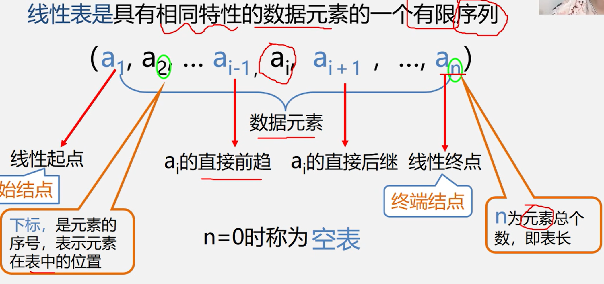
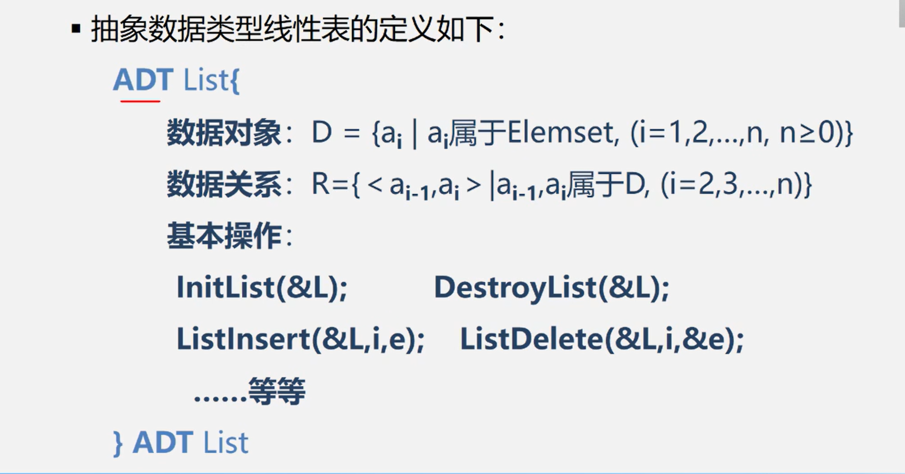
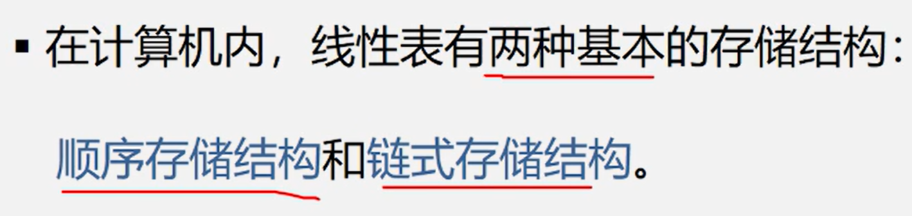
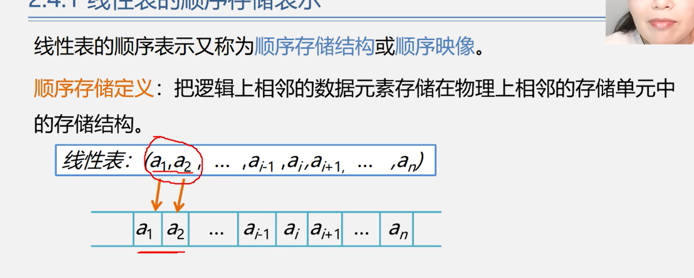
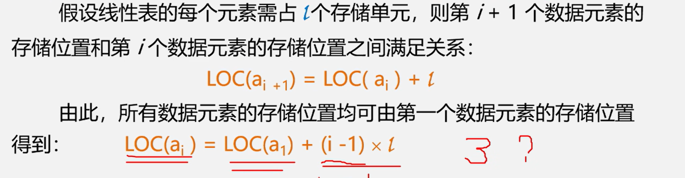

# 线性表学习
                  时间：25.10.27
                  

线性表的定义：具有相同特性的数据元素的一个有限序列

内部节点每一元素有且只有一个前驱，每一个元素也有且只有一个后续

## 线性表的类型定义：

## 线性表的存储结构

## 线性表的顺序结构存储表示

关于顺序表中的元素存储位置的计算

关于这里的减一，其实是很好理解的，就像3-2=1 一样，3和2之间并没有再间隔一个数，这里其实就是这样，因为感觉数字即0开始设计就是为了记录间隔的好像看起来，比如3-2=1，如果是看作间隔计算就很对了

